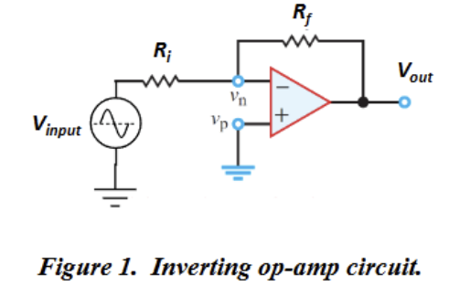

#### 6/18/2025

1.  **study and practice markdown syntax and grammar**
    - https://www.markdownguide.org/basic-syntax/
    

    - [x] testing checkboxes
    - [ ] testing checkboxes

    test~base~
    test^exponent^


<p><span style="font-family: 'Georgia';">
everything between the span lines will be changed into Georgia. This is only
in html however so regular markdown won't work in here
</span></p>

``` python
#testing putting blocks of code within markdown
number = 5
x = number - 10
print(x)
```

2. **familiarize self with git and its functionalities**
    - creating respositories
    - committing, pushing, and pulling to respositories
    
